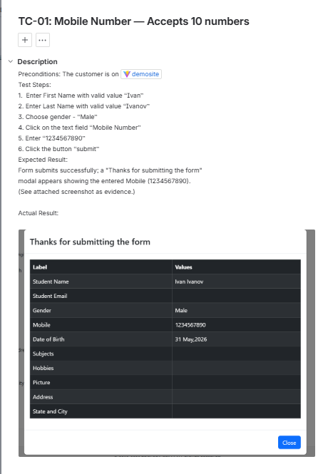
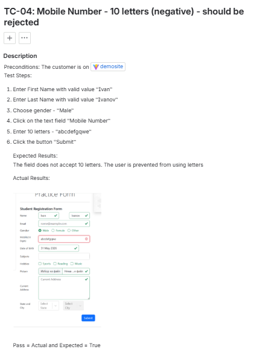

# QA Test Design — DemoQA Practice Form

Manual test design and execution portfolio: applying **Equivalence Partitioning (EP)**
and **Boundary Value Analysis (BVA)** to a real web form, with test cases authored
and executed in **Jira (Kanban)**.

## 🎯 Objective

Design a focused, high-coverage set of test cases for the **Mobile Number** field of
the [DemoQA Automation Practice Form](https://demoqa.com/automation-practice-form),
using black-box techniques to maximise coverage with a minimum number of tests.

## 📋 Field under test

| Property | Value |
|----------|-------|
| Field | Mobile Number |
| Rule | Exactly 10 digits, numeric only, mandatory |
| Other mandatory fields | First Name, Last Name, Gender (held valid to isolate the variable) |

## 🧪 Techniques applied

- **Equivalence Partitioning** — grouped all possible inputs into behaviour classes:
  one valid class (10 digits) and several invalid classes (too short, too long,
  letters, symbols, mixed, whitespace, empty).
- **Boundary Value Analysis** — attacked the length boundary "10" with **9 / 10 / 11**.

Result: **9 test cases** instead of testing all combinations (3 lengths × 7 content
types = 21), demonstrating efficient, risk-based coverage.

## ✅ Results

| | |
|---|---|
| Test cases designed | 9 |
| Executed | 9 |
| Passed | 9 |
| Defects found | 0 |

Full details: **[test-cases.md](./test-cases.md)**

## 📸 Evidence

Each test case was executed against the live site and documented in Jira with an
attached screenshot. All evidence is in [`/screenshots`](./screenshots) (TC-01…TC-09).

**Example — TC-01 (valid 10 digits, successful submission):**

**Example — TC-04 (10 letters rejected, Mobile field flagged red, form not submitted):**

## 🛠️ Tools

- **Jira** (Team-managed Kanban) — test case management & workflow (To Do → In Progress → In Review → Done)
- **DemoQA** — application under test

## 👤 Author

Svilen Borisov — Junior QA Engineer
[GitHub](https://github.com/SvilenB24)
